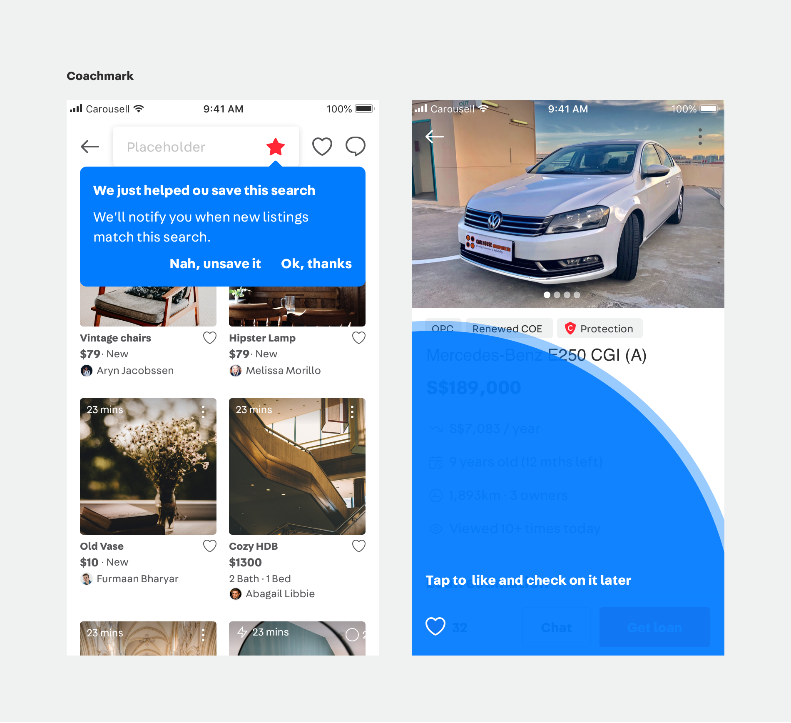
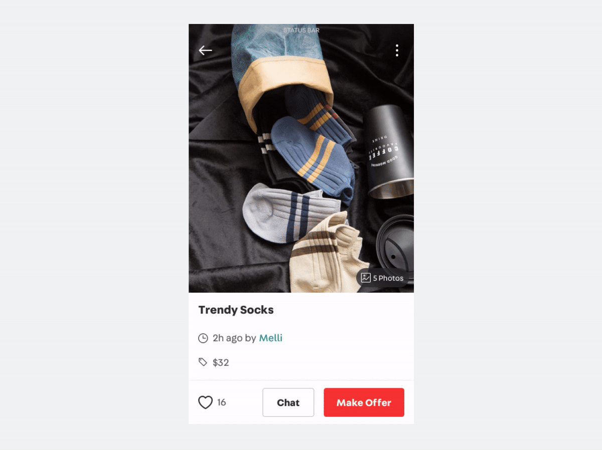
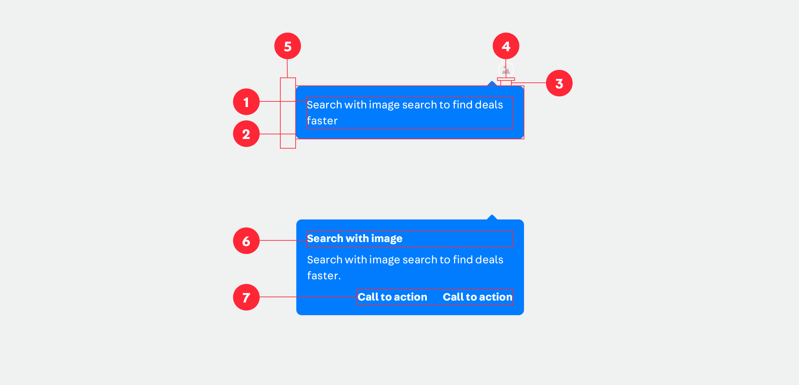
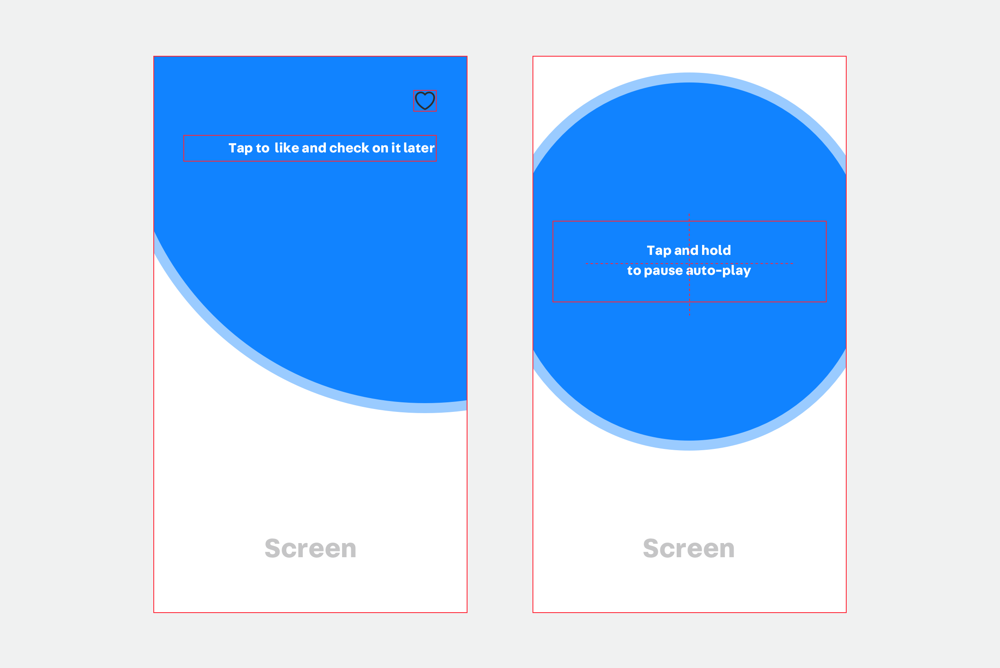
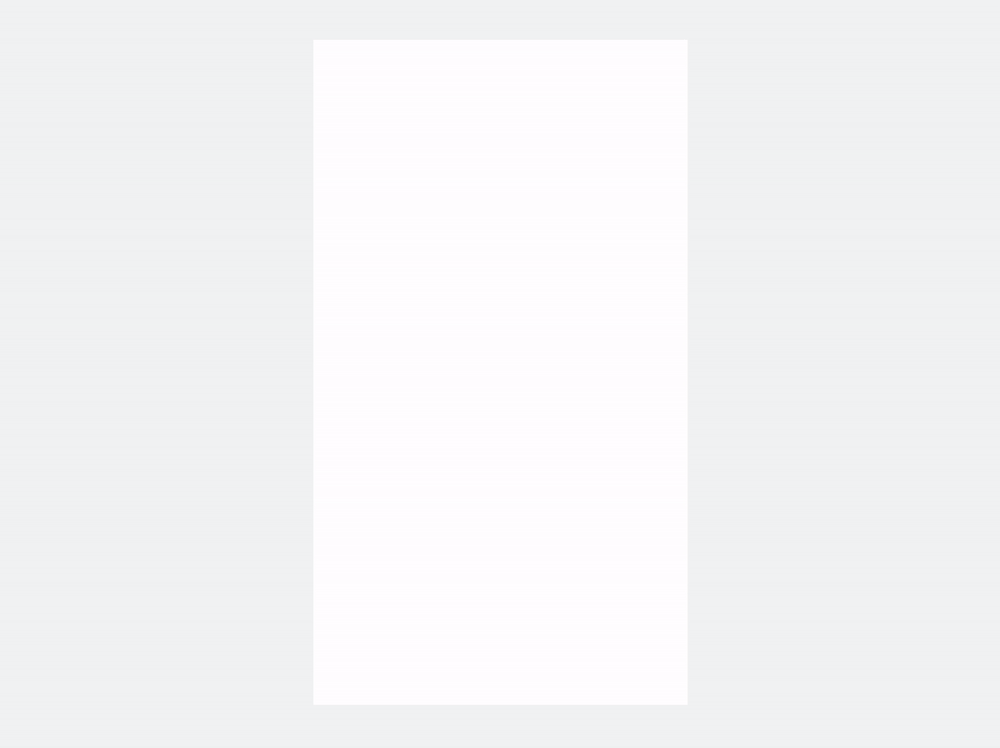
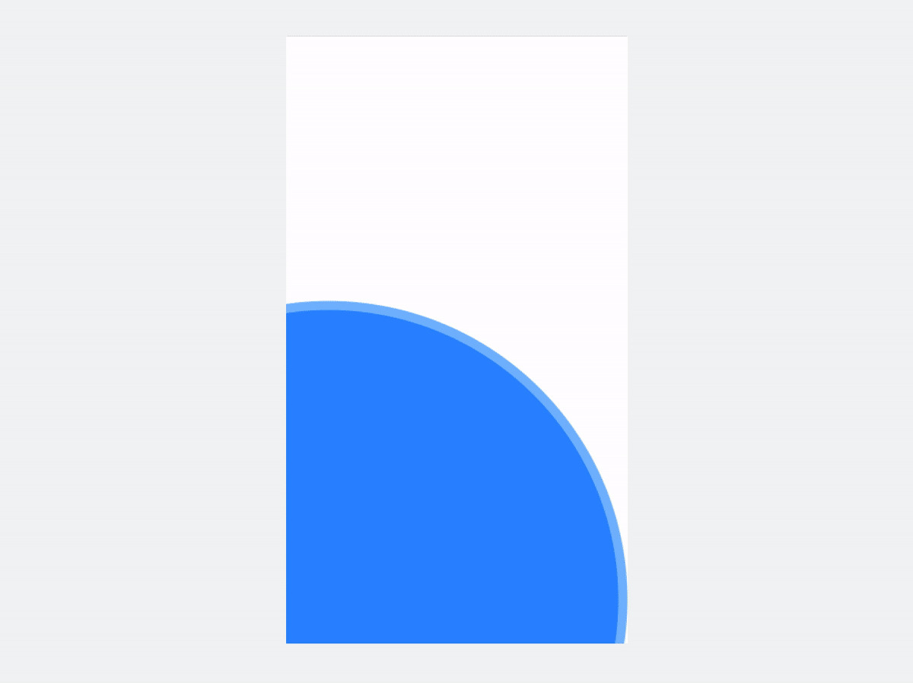
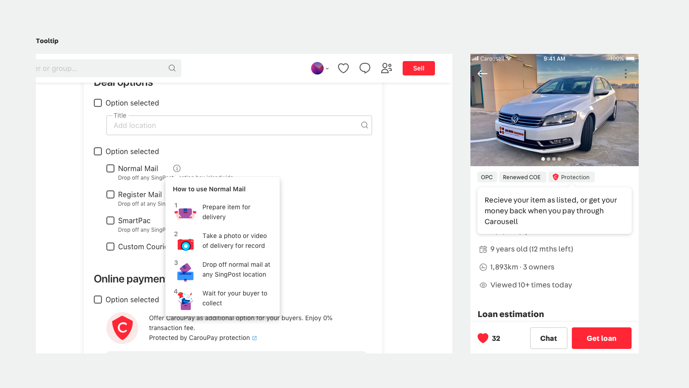

<PageDescription>

Tutorials are to help user adapt to the product, for example, user on-boarding, new feature announcements, or more detailed interactive walkthroughs.

</PageDescription>

Table of content

<AnchorLinks>
  <AnchorLink>Coach marks</AnchorLink>
  <AnchorLink>Speech bubble</AnchorLink>
  <AnchorLink>Circle overlay</AnchorLink>
  <AnchorLink>Tooltips</AnchorLink>
</AnchorLinks>

Difference between the two is that, Coach mark comes out automatically, and has a separate connection between the view; whereas Tooltip comes out after a user action, and has a more harmony connection with the view.

## Coach marks

Coach mark comes out automatically. User can tap anywhere on the screen to dismiss coach marks. Once the coach mark is dismissed, it will NOT appear again in the same session. 

<Row>
<Column colMd={4} colLg={4}>

</Column>
<Column colMd={4} colLg={4}>

</Column>
</Row>

### UI suggestion 

- Size and position of the component could be adjusted based on the context
- Use coach marks sparingly, suggest to let it ONLY appear after a page transition
- Avoid more than once in a session, because it might affect user’s flow of a task, for good reasons

## Speech bubble

### Developer documentation

| Platform | Development Status                                                                  | Design spec / resource links                  |
| -------- | ----------------------------------------------------------------------------------- | --------------------------------------------- |
| Android  | Available / Unplanned / In Progress (to be linked w jira or engineering guidelines) | https://zpl.io/2pjw76Q https://zpl.io/2pjwPWo |
| iOS      | Available / Unplanned / In Progress (to be linked)                                  | https://zpl.io/b6oGBnN https://zpl.io/bee6O0z |
| mPWA     | N/A                                                                                 | N/A                                           |
| dPWA     | N/A                                                                                 | N/A                                           |

### Anatomy

- Background pointer points to and central aligned with the targeted UI element
- It has a dismissal link

| Mandatory elements          | Notes                                             |
| --------------------------- | ------------------------------------------------- |
| 1. Body                     | White; Large, up to 3 lines                       |
| 2. Backgound                | `DeepBlue50 dynamic width; inner padding 16px/dp` |
| 3. Pointer                  | Size: fixed                                       |
| 4. Padding between pointer  | fixed: 4px/dp                                     |
| 5. Padding on the side      | fixed: 16px/dp                                    |

##  Circle overlay

### Developer documentation

| Platform | Development Status                                                                  | Design spec / resource links                  |
| -------- | ----------------------------------------------------------------------------------- | --------------------------------------------- |
| Android  | Available / Unplanned / In Progress (to be linked w jira or engineering guidelines) | https://zpl.io/2pjw76Q https://zpl.io/2pjwPWo |
| iOS      | Available / Unplanned / In Progress (to be linked)                                  | https://zpl.io/b6oGBnN https://zpl.io/bee6O0z |
| mPWA     | N/A                                                                                 | N/A                                           |
| dPWA     | N/A                                                                                 | N/A                                           |

### Anatomy

- The circle center central aligns to the targeted UI element on the page
- It has a dismissal link

### Lottie implementation

<Row>
<Column colMd={4} colLg={4}>

</Column>
<Column colMd={4} colLg={4}>

</Column>
</Row>

## Tooltips

Tooltip comes out after a user action, clicking or hovering. 

