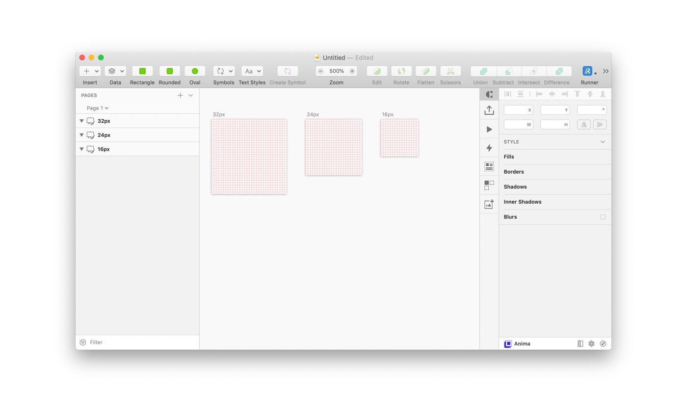
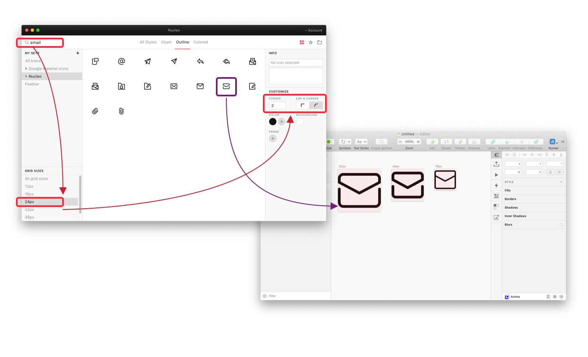
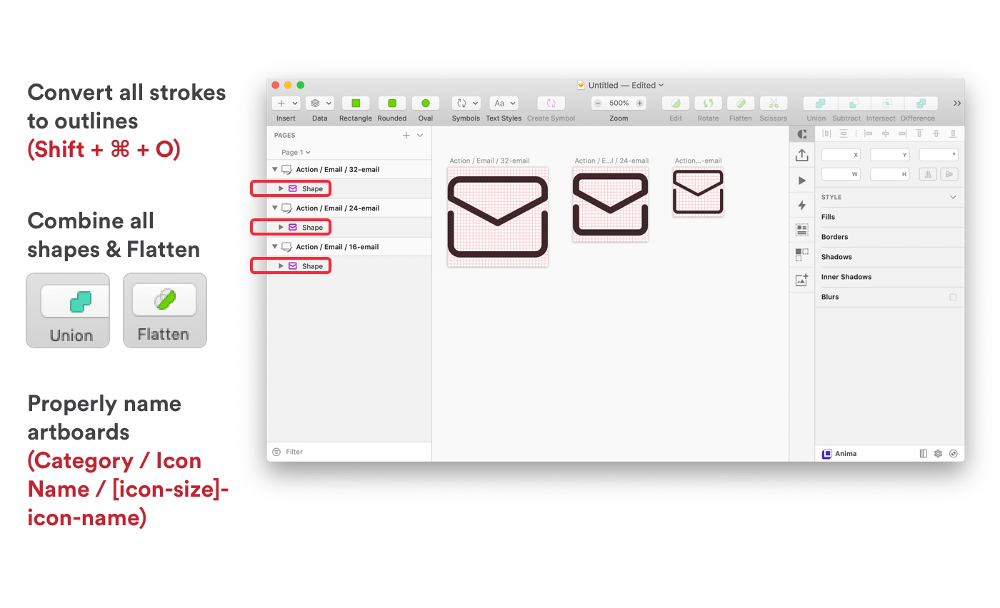

<PageDescription>

Adding new icons to Donut icon set

</PageDescription>

Table of content

<AnchorLinks>
  <AnchorLink>Resource</AnchorLink>
  <AnchorLink>Guideline for Designer</AnchorLink>
  <AnchorLink>Production-ready icon</AnchorLink>
  <AnchorLink>Making an icon</AnchorLink>
  <AnchorLink>Use our icon set</AnchorLink>
</AnchorLinks>

### Resource

<Row className="resource-card-group">
<Column colMd={4} colLg={4} noGutterSm>
    <ResourceCard
      subTitle="Icon Manager"
      title="Nucleo App"
      aspectRatio="2:1"
      href="https://nucleoapp.com/"
      >

  </ResourceCard>
</Column>
<Column colMd={4} colLg={4} noGutterSm>
    <ResourceCard
      subTitle="All icons"
      title="Full icon set"
      actionIcon="download"
      aspectRatio="2:1"
      href="https://drive.google.com/file/d/1K5H5ggSIWgO6NG7qIkyaSQX_GZhNSm-U/view"
      >

  </ResourceCard>
</Column>
</Row>

### Guideline for Designer
- All icons should be unique and not redundant with any existing icons in the system. Search our sketch library for the keyword(s) associated with your proposed new icon to ensure that it is not already represented.
- All icons should be rounded corner at the edge
- All icons should be understandable by a global audience of users, regardless of nationality or language.

### Production-ready icon

To be considered production-ready (to merge to the master library file), icons should

- Include all sizes (16px 24px and 32px)
- Icons should be at whole pixels. No decimals are allowed in x and y coordinates or width and height fields.
- All strokes must be expanded (convert all strokes to outlines `(Shift + ⌘ + O)`) and at full pixel values.
- All possible shapes and paths should be combined.

### Making an icon

Make with Nucleo icon set

1. Create a 16 x 16, 24 x 24 or 32 x 32 px artboard for each icon.
2. Select specific icon size & stroke value in Nucleo then search for keyword then drag the icon to given artboard. Icon stroke: 1px stroke for 16px icon, 2px stroke for 24 & 32px icon. All the icon should have round corner stroke.
3. Adjust the icon if you need.
4. Expand all strokes (convert all strokes to outlines `(Shift + ⌘ + O)`) and at full pixel values.
5. Combine all shapes and paths.
6. Ungroup icon layers completely. The icon should be on the top-most layer in your artboard.
7. Apply Layer Style for that icon so that we can change the colours from other files.
8. Make sure to properly name layers and artboards (these names will also be exported into the code).

<Row>
<Column colMd={4} colLg={4}>

</Column>
<Column colMd={4} colLg={4}>

</Column>
<Column colMd={4} colLg={4}>

</Column>
</Row>

### Use our icon set

1. Download Nucleo app and install it from [NucleoApp](https://nucleoapp.com/)
2. Download our full icon set.
3. Unzip that zip file and drag folder to Nucleo app.
4. Enjoy the ultimate icon set and play with your ideas.

### More about designing icons

<Row className="resource-card-group">
<Column colMd={4} colLg={4} noGutterSm>
    <ResourceCard
      subTitle="Link"
      title="Tips on design icon for User Interface"
      aspectRatio="2:1"
      href="https://medium.muz.li/icon-set-3b4fc87dc6b5?gi=53275cc041c7"
      >

  </ResourceCard>
</Column>
<Column colMd={4} colLg={4} noGutterSm>
    <ResourceCard
      subTitle="Link"
      title="IBM Carbon design system"
      aspectRatio="2:1"
      href="https://www.carbondesignsystem.com/guidelines/icons/library"
      >

  </ResourceCard>
</Column>
<Column colMd={4} colLg={4} noGutterSm>
    <ResourceCard
      subTitle="Link"
      title="Keylines & Optical Effects"
      aspectRatio="2:1"
      href="https://medium.muz.li/optical-effects-9fca82b4cd9a"
      >

  </ResourceCard>
</Column>

</Row>