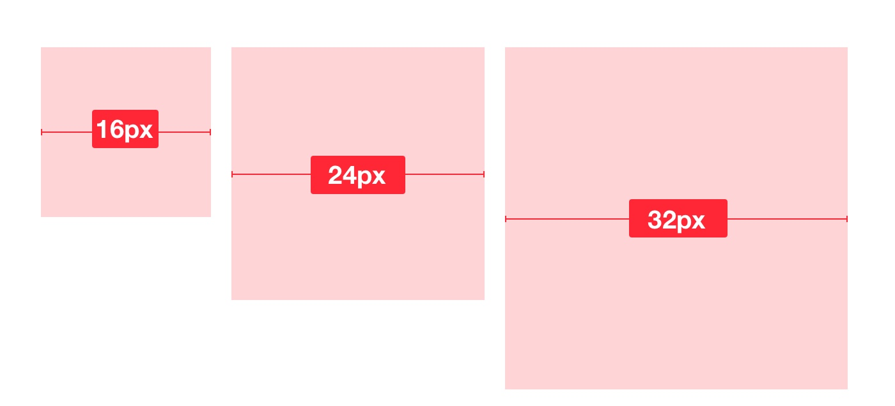
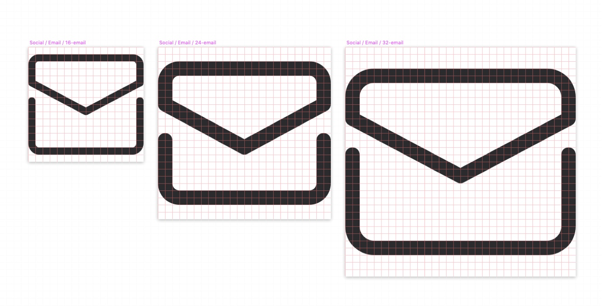
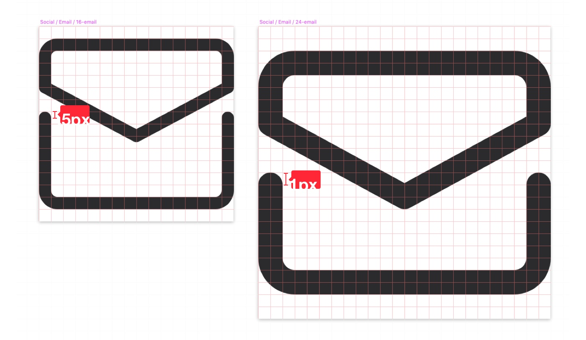
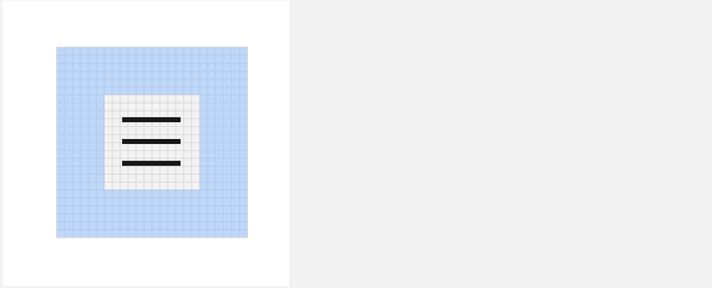
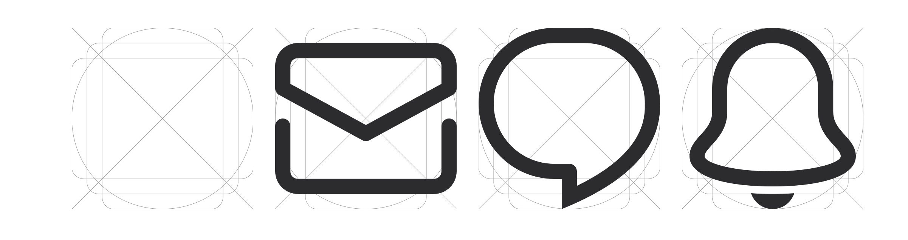
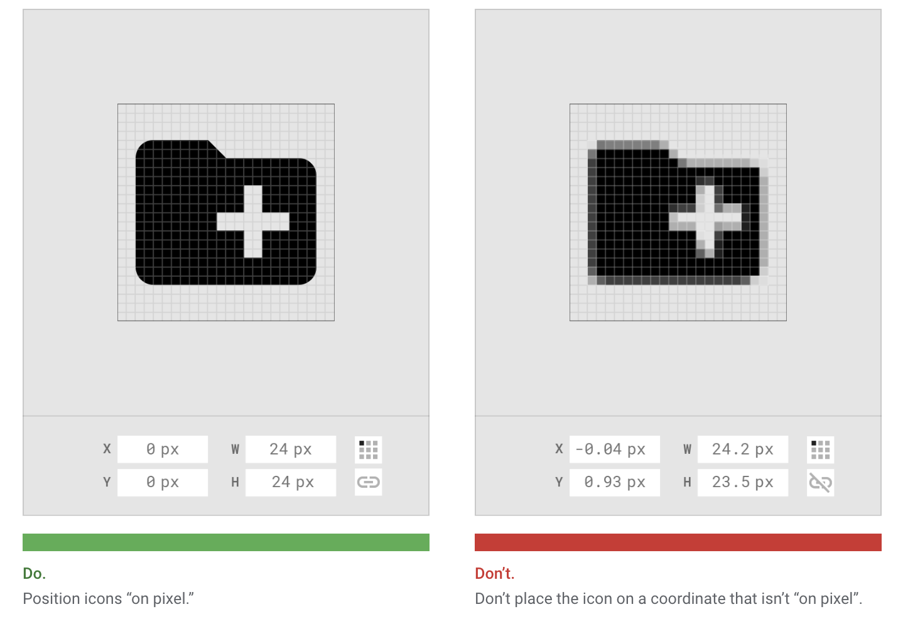

<PageDescription>

Icons are visual symbols used to represent ideas, objects, or actions. They communicate messages at a glance, afford interactivity, and draw attention to important information.

</PageDescription>

Table of content

<AnchorLinks>
  <AnchorLink>Resource</AnchorLink>
  <AnchorLink>Principles</AnchorLink>
  <AnchorLink>Designing with icons</AnchorLink>
</AnchorLinks>

<AnchorLinks small>
  <AnchorLink>Icon Sizing</AnchorLink>
  <AnchorLink>Stroke Weight</AnchorLink>
  <AnchorLink>Corners</AnchorLink>
  <AnchorLink>Visual Correction</AnchorLink>
  <AnchorLink>Perspective</AnchorLink>
  <AnchorLink>Naming Conventions</AnchorLink>
  <AnchorLink>Touch targets</AnchorLink>
  <AnchorLink>Keylines</AnchorLink>
  <AnchorLink>Clarity (Pixel perfection)</AnchorLink>
</AnchorLinks>

## Resource

<Row className="resource-card-group">
<Column colMd={4} colLg={4} noGutterSm>
    <ResourceCard
      subTitle="Production ready"
      title="Donut icon set"
      aspectRatio="2:1"
      href="https://www.figma.com/file/bEX9lgvC7uMtLTXrfwQbUO/Icons?node-id=1%3A7"
      >

  </ResourceCard>
</Column>
</Row>

## Principles
* Simple
* Outline stroke
* Rounded edges

## Designing with icons
### Icon Sizing
16px, 24px, 32px
Icons should only be used at their original sizes and not resized in code. We want to maintain the right detail for each icon and prevent half-pixel when resizing which can cause blurry icons.

Very rare cases, we need 20px, we can create an icon on this size to use.

### Stroke Weight
Consistent stroke weight is the key to maintaining the visual unity of the entire icon system. CDS icons have a consistent stroke width of 1px for 16px icon, 2px for 24px and 32px icon.

### Corners
Consistent rounding of corners and sizing help maintain visual unity.
Icons in CDS should have rounded corners and edges using a .5px radius for 16px icon and 1px for 24 & 32 icon.

### Visual Correction
In certain special cases (for example, when  the icon is too compact, brand logo), adjustments to line width, outlines, or other subtle changes may be made to increase readability.

### Perspective
Always keep a simple, flat style. Icons should not have a sense of depth nor a large amount of detail. Detailed icons increase cognitive load.

### Naming Conventions
Uniform naming conventions make finding icons faster and easier.
* Icon artboard’s name: Category / Icon Name / [icon-size]-icon-name. e.g: Action / Like / 24-like
* Icon with outline circle should end with -o, icon with filled style should end with -f

### Touch targets
All touch targets for interactive icons need to be 44 px or larger for iOS/Android. Developers can add padding to a touch target to meet the 44px requirement.

### Keylines
Key lines play an important role in making various icons with the same visual effect.

Beware of becoming your grid’s slave. It is to help, not to restrict. If an icon is visually better with some sticking out elements, let them stick out.

### Clarity (Pixel perfection)
To avoid distorting an icon, position icons “on pixel” by making the X and Y coordinates into integers, without decimals.

## Do Dont Example

<Row>
<Column colMd={4} colLg={4}>

#### Image

<DoDontExample type="do" captionTitle="Caption title" caption="Caption">

</DoDontExample>
</Column>
<Column colMd={4} colLg={4}>

#### Text

<DoDontExample type="dont" aspectRatio="1:1"  color="dark" captionTitle="Caption title" caption="Caption" text="This is some text" />
</Column>
</Row>

## Props

| property     | propType | required | description                                                                                                                                                                                                                                        |
| ------------ | -------- | -------- | ------- | -------------------------------------------------------------------------------------------------------------------------------------------------------------------------------------------------------------------------------------------------- |
| children     | node     |         | child node, expects a markdown image or `<Video>` component                                                                                                                                                                                        |
| text         | string   |         | text to display inside the component instead of an image or video                                                                                                                                                                                  |
| caption      | string   |         | caption                                                                                                                                                                                                                                            |
| captionTitle | string   |         | caption title                                                                                                                                                                                                                                      |
| type         | string   | dont    | set to `do` to show green check, otherwise shows pink X                                                                                                                                                                                            |
| color        | string   | light   | set to `dark` for dark background card                                                                                                                                                                                                             |
| aspectRatio  | string   |         | set to `1:1` to force square example |
